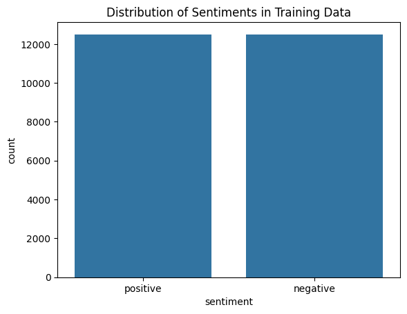
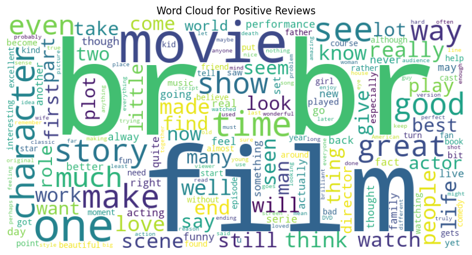
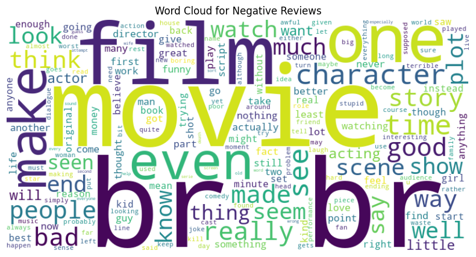

# **Laporan Proyek Machine Learning - Kristian**


## **1. Domain Proyek**  


### **1.1 Latar Belakang**

Dalam era digital modern, pengguna internet secara aktif membagikan opini mereka terhadap berbagai produk, layanan, maupun karya seni seperti film melalui berbagai platform daring. Situs populer seperti *Internet Movie Database (IMDb)*, *Rotten Tomatoes*, dan *Metacritic* menyediakan ruang bagi pengguna untuk menulis ulasan (*review*) yang mengandung ekspresi sentimen positif atau negatif. Volume data ulasan yang sangat besar menjadikan analisis manual terhadap opini pengguna tidak efisien dan memakan waktu. Oleh karena itu, diperlukan pendekatan otomatis berbasis **machine learning** untuk mengklasifikasikan sentimen teks secara cepat dan akurat.

Salah satu metode yang banyak digunakan dalam analisis sentimen adalah **Support Vector Machine (SVM)**, khususnya varian **LinearSVC** yang efisien untuk data berdimensi tinggi seperti hasil representasi **TF-IDF (Term Frequency–Inverse Document Frequency)** [1]. Namun, performa LinearSVC sangat bergantung pada pemilihan **hyperparameter** yang tepat, seperti `C`, `loss`, dan `class_weight`. Untuk mengoptimalkan parameter-parameter tersebut, proyek ini menerapkan **Bayesian Optimization**, yaitu metode pencarian hiperparameter yang adaptif dan efisien dibandingkan pendekatan *grid search* maupun *random search* [2].

Dengan pendekatan ini, proyek ini bertujuan untuk membangun model *machine learning* yang mampu mengklasifikasikan ulasan film ke dalam dua kategori sentimen (positif dan negatif) secara optimal menggunakan dataset ulasan film IMDb [3].


### **1.2 Mengapa dan Bagaimana Masalah Ini Harus Diselesaikan**

Analisis sentimen memiliki dampak signifikan dalam berbagai bidang, seperti:
- **Industri film**, untuk memahami opini penonton terhadap film dan mendukung strategi promosi.  
- **Bisnis dan pemasaran**, untuk menilai persepsi pelanggan terhadap produk atau layanan.  
- **Penelitian sosial**, untuk menganalisis opini publik terhadap isu tertentu melalui data media sosial.

Dengan penerapan model klasifikasi sentimen berbasis *machine learning* yang efisien dan teroptimasi, organisasi dapat memperoleh **insight yang lebih akurat, cepat, dan dapat diandalkan** untuk mendukung pengambilan keputusan berbasis data (*data-driven decision making*).


### **1.3 Hasil Riset dan Referensi**

Topik ini dipilih karena:  
- Analisis sentimen merupakan **kasus klasik dalam Natural Language Processing (NLP)** yang relevan untuk berbagai aplikasi nyata.  
- Dataset **IMDB Large Movie Review** [3] merupakan dataset benchmark yang kredibel dan banyak digunakan untuk menguji model analisis sentimen.  
- Fokus proyek ini bukan sekadar membangun model klasifikasi, tetapi juga **mengoptimalkan performa model** dengan pendekatan Bayesian Optimization [2], yang terbukti efisien dalam menemukan kombinasi parameter terbaik dengan jumlah iterasi yang lebih sedikit.


## **2. Business Understanding**

Pada bagian ini, proyek difokuskan untuk memahami dan memformulasikan masalah bisnis yang akan diselesaikan melalui pendekatan *machine learning*, khususnya dalam konteks **analisis sentimen terhadap ulasan film**. Analisis ini penting karena opini pengguna memiliki pengaruh besar terhadap reputasi film dan strategi pemasaran di industri hiburan.


### **2.1 Problem Statements**

- **Bagaimana cara mengklasifikasikan sentimen dari teks ulasan film secara otomatis menjadi kategori positif atau negatif?**  
   Ulasan film di internet bersifat tidak terstruktur dan beragam, sehingga memerlukan sistem otomatis yang mampu memahami konteks bahasa alami untuk menentukan sentimennya.  
- **Bagaimana cara meningkatkan performa model klasifikasi sentimen agar lebih akurat dan efisien?**  
   Model dasar seperti LinearSVC memiliki performa yang baik untuk teks berdimensi tinggi, namun sangat bergantung pada pemilihan hyperparameter yang optimal agar dapat mencapai hasil maksimal.  
- **Bagaimana mengatasi potensi bias model terhadap kelas tertentu (positif atau negatif)?**  
   Model klasifikasi sering kali lebih akurat pada satu kelas saja jika distribusi data tidak seimbang atau jika parameter tidak diatur dengan baik.


### **2.2 Goals**

- Mengembangkan model *machine learning* berbasis **LinearSVC** yang mampu mengklasifikasikan teks ulasan film ke dalam dua kategori sentimen utama: **positif** dan **negatif**.  
- Melakukan **optimasi hyperparameter** menggunakan pendekatan **Bayesian Optimization** untuk meningkatkan akurasi model dan kestabilan prediksi.  
- Mengevaluasi model berdasarkan metrik performa seperti **accuracy**, **precision**, **recall**, dan **F1-score**, guna memastikan model memiliki kinerja yang seimbang antar kelas.  

Dengan tercapainya ketiga tujuan di atas, sistem yang dihasilkan diharapkan dapat secara efektif melakukan klasifikasi sentimen teks dalam skala besar dan mendukung pengambilan keputusan berbasis opini publik.


### **2.3 Solution Statements**

Untuk mencapai tujuan di atas, solusi proyek ini dirancang dalam dua tahap pendekatan utama:

- **Baseline Model – LinearSVC Default Parameters**  
   Pada tahap awal, digunakan model **Linear Support Vector Classifier (LinearSVC)** dengan parameter default dari *scikit-learn* [4]. Model ini dilatih menggunakan representasi teks **TF-IDF** untuk mengubah kata menjadi vektor numerik berdimensi tinggi. Tujuannya adalah mendapatkan performa dasar yang dapat dijadikan pembanding terhadap hasil optimasi.

- **Optimized Model – LinearSVC with Bayesian Optimization**  
   Tahap berikutnya dilakukan **optimasi hyperparameter** menggunakan metode **Bayesian Optimization** melalui `BayesSearchCV` [5]. Pendekatan ini memanfaatkan probabilistik untuk memperkirakan kombinasi parameter terbaik (`C`, `loss`, `class_weight`) yang memberikan hasil akurasi tertinggi berdasarkan validasi silang (*cross-validation*). Dengan strategi ini, model diharapkan:
   - Mencapai **akurasi validasi di atas 89%**,  
   - Menunjukkan **keseimbangan performa antar kelas positif dan negatif**,  
   - Serta **mengurangi overfitting** yang mungkin terjadi pada baseline model.

Evaluasi dilakukan menggunakan *10-fold cross-validation* untuk memastikan hasil model stabil dan dapat digeneralisasi dengan baik terhadap data baru.


### **2.4 Keterukuran Solusi**

Solusi ini bersifat **terukur** karena performa model dinilai menggunakan metrik evaluasi kuantitatif berikut:
- **Accuracy** → mengukur proporsi prediksi benar dari total data.  
- **Precision dan Recall** → mengukur keseimbangan model dalam mendeteksi kelas positif dan negatif.  
- **F1-score** → sebagai ukuran harmonik yang menggabungkan precision dan recall.  

Metrik tersebut memungkinkan perbandingan objektif antara model baseline dan model hasil optimasi, serta memastikan bahwa peningkatan performa dapat dibuktikan secara kuantitatif [6].  


## **3. Data Understanding**

Dataset yang digunakan dalam proyek ini adalah **IMDb Large Movie Review Dataset** yang disediakan oleh *Stanford AI Lab*. Dataset ini berisi ulasan (review) film yang ditulis oleh pengguna IMDb dan diberi label sentimen **positif** atau **negatif**. Dataset ini menjadi salah satu benchmark populer dalam penelitian **Natural Language Processing (NLP)** dan **Sentiment Analysis** karena ukurannya yang besar serta keseimbangan antar kelasnya.

Dataset dapat diakses secara publik melalui tautan resmi berikut:  
[https://ai.stanford.edu/~amaas/data/sentiment/](https://ai.stanford.edu/~amaas/data/sentiment/)


### **3.1 Deskripsi Dataset**

- Jumlah total data pelatihan (train): **25.000 ulasan**
- Jumlah total data pengujian (test): **25.000 ulasan**
- Jumlah total sampel keseluruhan: **50.000 ulasan**
- Jumlah label: **2 kelas** — *positive (1)* dan *negative (0)*
- Format data: Setiap baris terdiri dari satu teks ulasan film dan label sentimennya.

Data dibagi menjadi dua set utama:
- **Train set (25.000 sampel)** → digunakan untuk melatih model dan melakukan validasi.  
- **Test set (25.000 sampel)** → digunakan untuk mengukur kinerja model terhadap data baru.  

Dataset ini memiliki distribusi kelas yang **seimbang**:
- **12.500 ulasan positif**
- **12.500 ulasan negatif**

Distribusi label yang seimbang ini memudahkan proses pelatihan dan evaluasi model karena tidak terjadi bias terhadap salah satu kelas.


### **3.2 Variabel dalam Dataset**

Variabel utama yang digunakan dalam proyek ini adalah:

| Variabel | Deskripsi |
|-----------|------------|
| `review` | Teks ulasan film dalam format kalimat alami (raw text). |
| `sentiment` | Label hasil anotasi manusia yang menunjukkan apakah ulasan tersebut bersentimen positif (`1`) atau negatif (`0`). |


### **3.3 Exploratory Data Analysis (EDA)**

Beberapa tahapan eksplorasi dan visualisasi dilakukan untuk memahami struktur dan karakteristik data sebelum pemodelan:  


#### **3.3.1 Distribusi Sentimen**

Distribusi label sentimen pada dataset pelatihan menunjukkan keseimbangan yang sempurna antara *positif* dan *negatif*, masing-masing sebanyak 12.500 ulasan. Hal ini divisualisasikan menggunakan grafik *countplot*:

```python
sns.countplot(x='sentiment', data=train_df)
plt.title('Distribution of Sentiments in Training Data')
```

 


#### **3.3.2 Visualisasi Word Cloud**

Dilakukan visualisasi **Word Cloud** untuk mengidentifikasi kata-kata yang paling sering muncul pada masing-masing kategori sentimen. Visualisasi ini membantu memahami kata apa saja yang paling berpengaruh dalam membentuk sentimen ulasan film.  

  
**Kata dominan pada review positif:** `film`, `good`, `great`, `love`, `story`, `character`, dan kata lain yang merepresentasikan kesan positif terhadap film.  

  
**Kata dominan pada review negatif:** `bad`, `boring`, `waste`, `terrible`, `poor`, dan kata lain yang menunjukkan ketidakpuasan penonton.  

Visualisasi ini memberikan wawasan bahwa kata-kata yang sering muncul cukup merepresentasikan **polaritas emosional** dari ulasan, di mana ulasan positif didominasi oleh kata yang bernuansa apresiatif dan ulasan negatif didominasi oleh kata yang bernuansa kekecewaan.  


#### **3.3.3 Insight Awal**
Dari hasil eksplorasi data (EDA), ditemukan beberapa hal penting sebagai berikut:  
- Banyak kata tidak relevan seperti `br` (tag HTML `<br />`) yang muncul hampir di semua ulasan. Tag ini merupakan artefak dari format HTML dan perlu dibersihkan.  
- Terdapat kata-kata umum (*stopwords*) seperti `the`, `is`, `and`, `one`, dan sejenisnya yang tidak berkontribusi terhadap pembentukan makna sentimen.  
- Diperlukan tahapan **text preprocessing** untuk meningkatkan kualitas data teks, meliputi:  
    - *HTML Cleaning* → menghapus tag HTML seperti `<br />`.  
    - *Stopword Removal* → menghapus kata umum yang tidak bermakna sentimen.  
    - *Lemmatization* → mengembalikan kata ke bentuk dasar agar konsisten dalam analisis.  

Langkah-langkah ini dilakukan sebelum data dimasukkan ke dalam model untuk memastikan representasi teks yang bersih, relevan, dan optimal bagi proses pembelajaran mesin.  
 


## **4. Data Preparation**

Tahap **data preparation** dilakukan untuk membersihkan dan mengubah data teks mentah (*raw text*) menjadi representasi numerik yang dapat diproses oleh algoritma *machine learning*. Proses ini sangat penting karena kualitas data yang diolah akan memengaruhi performa model yang dibangun. Berikut tahapan-tahapan *data preparation* yang diterapkan pada proyek ini:


### **4.1 Text Cleansing**

Langkah pertama adalah menghapus elemen-elemen yang tidak relevan dari teks ulasan agar model fokus pada kata bermakna. Beberapa operasi yang dilakukan antara lain:

- Menghapus tag HTML (contoh: `<br />`)
- Menghapus karakter non-alfabet (angka, simbol, tanda baca)
- Mengubah seluruh teks menjadi huruf kecil (lowercasing)
- Menghapus *extra whitespace*  

Contoh implementasi:

```python
def preprocess_text(text):
    text = text.lower()
    text = re.sub(r'<br\s*/?>', ' ', text)
    text = re.sub(r'<.*?>', ' ', text)
    text = re.sub(r'\d+', ' ', text)
    text = text.translate(str.maketrans("", "", string.punctuation))
    text = re.sub(r'\s+', ' ', text).strip()

    return text
```


### **4.2 Label Encoding**

Tahap **label encoding** dilakukan untuk mengubah data kategorikal menjadi representasi numerik agar dapat diproses oleh algoritma *machine learning*. Dalam konteks proyek ini, label encoding diterapkan pada **label sentimen** yang terdiri dari dua kategori teks: *positive* dan *negative*. Agar dapat diproses oleh algoritma LinearSVC, label ini dikonversi menjadi nilai numerik menggunakan **LabelEncoder** dari pustaka *scikit-learn*. Label `positive` dikonversi menjadi `1` dan label `negative` dikonversi menjadi `0`. 

```python
le = LabelEncoder()
train_df['sentiment_encoded'] = le.fit_transform(train_df['sentiment'])
test_df['sentiment_encoded'] = le.transform(test_df['sentiment'])
```


### **4.3 Train-Test Split**

Tahapan **Train-Test Split** merupakan proses penting dalam *pipeline* machine learning karena berfungsi untuk memisahkan data yang digunakan untuk **melatih model**, **memvalidasi performa model**, dan **menguji generalisasi model**. Tujuan utama langkah ini adalah memastikan bahwa model *machine learning* dapat **belajar dari pola yang ada dalam data pelatihan** tanpa menghafal data (overfitting), serta **dapat memprediksi data baru secara akurat**.


#### **4.3.1 Pembagian Data**

Dalam proyek ini, dataset IMDb yang berisi **50.000 ulasan film** dibagi menjadi dua bagian besar:
- **Training data (25.000 sampel)** → digunakan untuk pelatihan dan validasi model.  
- **Testing data (25.000 sampel)** → digunakan untuk evaluasi akhir model terhadap data yang belum pernah dilihat sebelumnya.

Selanjutnya, data pelatihan (25.000 sampel) dibagi kembali menjadi dua subset:
- **Training set:** 80% dari data pelatihan (20.000 sampel).  
- **Validation set:** 20% dari data pelatihan (5.000 sampel).

Pembagian ini dilakukan menggunakan fungsi `train_test_split()` dari pustaka *scikit-learn* dengan parameter `stratify` untuk menjaga keseimbangan distribusi label antara dua subset.


#### **4.3.2 Implementasi pada Notebook**

Berikut adalah potongan kode pembagian data sesuai implementasi dalam proyek:

```python
X_train, X_val, y_train, y_val = train_test_split(
    train_df['clean_review'],
    train_df['sentiment_encoded'],
    test_size=0.2,
    random_state=42,
    stratify=train_df['sentiment_encoded']
)
```


#### **4.3.3 Alasan Penggunaan Stratified Sampling**

Metode **stratified split** dipilih untuk memastikan distribusi label (**positif** dan **negatif**) tetap seimbang antara subset pelatihan dan validasi. Hal ini penting karena dataset IMDb memiliki dua kelas yang seimbang (50% positif dan 50% negatif). Tanpa stratifikasi, pembagian acak dapat menyebabkan perbedaan kecil dalam proporsi kelas, yang dapat memengaruhi hasil pelatihan dan validasi.

**Manfaat stratified sampling dalam konteks klasifikasi biner:**

- **Mencegah bias model** terhadap kelas dengan jumlah sampel lebih banyak.  
- **Menjamin hasil evaluasi lebih representatif** karena proporsi label sama dengan distribusi aslinya.  
- **Meningkatkan stabilitas model**, terutama saat digunakan dalam proses *cross-validation* atau *hyperparameter tuning*.

Dengan demikian, pembagian data yang seimbang merupakan fondasi penting agar metrik evaluasi seperti **accuracy**, **precision**, dan **F1-score** benar-benar mencerminkan performa model yang sesungguhnya — bukan hasil bias distribusi label.


#### **4.3.4 Tujuan dari Setiap Subset Data**

| **Subset** | **Tujuan** | **Deskripsi** |
|-------------|------------|---------------|
| **Training Set** | Melatih model | Model belajar mengenali pola dalam teks dan relasinya dengan label sentimen. |
| **Validation Set** | Mengevaluasi model selama tuning | Digunakan selama proses **Bayesian Optimization** untuk mencari kombinasi hyperparameter terbaik. |
| **Testing Set** | Menilai generalisasi model | Data yang tidak pernah dilihat model, digunakan untuk mengukur kemampuan generalisasi akhir. |


#### **4.3.5 Pentingnya Train-Test Split dalam Generalisasi**

Salah satu kesalahan umum dalam proyek *machine learning* adalah mengevaluasi performa model pada data yang sama dengan data latih. Hal ini menyebabkan model tampak memiliki performa tinggi padahal tidak mampu menangani data baru (fenomena **overfitting**) [7]. Dengan membagi data menjadi beberapa subset yang independen, proyek ini memastikan bahwa performa yang dilaporkan benar-benar mencerminkan **kemampuan generalisasi model terhadap data dunia nyata**. Selain itu, penggunaan **data validasi terpisah (bukan hanya cross-validation)** memungkinkan proyek ini melakukan eksperimen tambahan, seperti:  
- Pengamatan terhadap *learning behavior* model pada data baru.  
- Evaluasi performa model saat dilakukan **hyperparameter tuning dengan Bayesian Optimization**.  
- Perbandingan antara hasil *training*, *validation*, dan *testing* untuk mendeteksi tanda-tanda *underfitting* atau *overfitting*.

Dengan pendekatan ini, pipeline *machine learning* menjadi lebih **robust**, **terukur**, dan **dapat digeneralisasi**, sehingga hasil evaluasi model benar-benar menggambarkan performa aktual dalam penerapan dunia nyata.


### **4.4 Tokenization**

Tahapan **tokenization** dilakukan untuk memecah teks ulasan menjadi unit-unit terkecil yang disebut **token**. Token dalam konteks analisis teks biasanya berupa kata, tanda baca, atau simbol. Pada proyek ini, tokenisasi digunakan untuk mengubah teks ulasan yang telah dibersihkan menjadi daftar kata yang akan diproses lebih lanjut melalui *lemmatization* dan representasi vektor (*TF-IDF*).


#### **4.4.1 Tujuan Tokenization**

Tokenization berfungsi untuk:
- Mengubah string kalimat menjadi kumpulan kata individual agar mudah diolah.  
- Menjadi dasar untuk tahapan *text preprocessing* berikutnya seperti *stopword removal* dan *lemmatization*.  
- Membantu model memahami struktur kalimat dengan mengubah teks menjadi unit yang lebih kecil dan bermakna.

Contoh sederhana:  

| **Teks Asli (sebelum Tokenisasi)** | **Hasil Tokenisasi** |
|------------------------------------|------------------------|
| `"This movie was absolutely fantastic!"` | `["this", "movie", "was", "absolutely", "fantastic"]` |
| `"The film was boring and too long."` | `["the", "film", "was", "boring", "and", "too", "long"]` |


#### **4.4.2 Alasan Pemilihan Tokenization**

Pemilihan metode tokenisasi berbasis **NLTK Word Tokenizer** dibandingkan metode manual menggunakan `.split()` bukan hanya didasarkan pada kemudahan implementasi, tetapi juga pada **akurasi linguistik** dan **konsistensi hasil pra-pemrosesan**. Dalam proyek ini, kualitas tahap tokenisasi sangat penting karena menentukan keberhasilan tahapan berikutnya, seperti *lemmatization*, *stopword removal*, dan *feature extraction* (TF-IDF). Oleh karena itu, diperlukan metode tokenisasi yang stabil, terstandarisasi, dan memiliki dukungan pustaka NLP yang kuat.

Beberapa alasan utama pemilihan metode ini antara lain:  
- **Akurasi tinggi dalam pemisahan kata dan tanda baca.**  
   *NLTK Word Tokenizer* mampu mengenali batas antar kata secara linguistik, bukan hanya berdasarkan spasi.  
   Hal ini penting untuk teks ulasan yang sering mengandung tanda baca seperti koma, titik, tanda seru, atau emotikon.  
   Sebagai contoh, kalimat `"This movie is great!"` akan diubah menjadi token `["This", "movie", "is", "great", "!"]`,  
   sedangkan metode `.split()` sederhana dapat kehilangan tanda baca penting yang berpotensi mengandung makna sentimen.  
- **Kemampuan menangani kontraksi dan ekspresi bahasa alami.**  
   Bahasa pada ulasan film sering kali bersifat informal dan mengandung kontraksi seperti *"don’t"*, *"it’s"*, *"I’m"*, atau *"didn’t"*.  
   *Word Tokenizer* dari NLTK mampu mengenali pola-pola tersebut dan memperlakukan kontraksi sebagai token valid.  
   Dengan demikian, kata seperti *"don’t"* tidak akan dipecah menjadi dua token *["don", "’t"]* yang dapat mengacaukan konteks semantik saat proses *lemmatization* atau *vectorization* dilakukan.
- **Kompatibilitas tinggi dengan pipeline lemmatization dan feature extraction.**  
   *NLTK Word Tokenizer* menghasilkan keluaran berupa *list* token yang langsung dapat digunakan dalam *WordNetLemmatizer*.  
   Ini mempercepat alur preprocessing dan memastikan setiap tahap berjalan konsisten tanpa perlu konversi tambahan.  
   Selain itu, integrasi antara *word_tokenize* dan *lemmatizer* dari pustaka yang sama (NLTK) mengurangi risiko kesalahan format atau ketidaksesuaian struktur data antar tahap.  
- **Kinerja yang efisien dan andal untuk dataset berukuran besar.**  
   Karena proyek ini menggunakan dataset IMDb yang terdiri dari **50.000 ulasan teks**, diperlukan metode tokenisasi yang cepat, efisien, dan teruji.  
   *NLTK Word Tokenizer* memiliki optimasi internal berbasis ekspresi reguler yang membuat proses tokenisasi tetap ringan meski dijalankan pada ribuan sampel teks.  

Dengan mempertimbangkan faktor-faktor di atas, penggunaan **NLTK Word Tokenizer** memberikan keseimbangan optimal antara **akurasi linguistik**, **efisiensi komputasi**, dan **kompatibilitas pipeline NLP**. Hal ini menjadikan metode ini lebih unggul dibandingkan pendekatan sederhana berbasis pemisahan spasi, yang cenderung tidak mampu menangani kompleksitas bahasa alami dalam teks ulasan film IMDb [8].


### **4.5 Stopword Removal**

Setelah tahap *tokenization*, langkah selanjutnya dalam proses *text preprocessing* adalah **Stopword Removal**, yaitu menghapus kata-kata umum yang tidak memiliki makna penting dalam konteks analisis sentimen. Kata-kata ini dikenal sebagai **stopwords**, contohnya seperti *“is”*, *“the”*, *“and”*, *“was”*, dan sebagainya. Tujuan dari langkah ini adalah **mengurangi noise** dalam data teks, sehingga model dapat lebih fokus mempelajari kata-kata yang benar-benar memiliki bobot semantik terhadap sentimen positif atau negatif.


### **45.1 Konsep dan Tujuan Stopword Removal**

Dalam Natural Language Processing (NLP), *stopwords* adalah kata-kata yang memiliki frekuensi tinggi dalam suatu bahasa tetapi tidak membawa informasi penting secara kontekstual, contohnya:  

> “The movie was not interesting at all.”  

Kata *“the”* dan *“was”* tidak berkontribusi pada makna sentimen dari kalimat tersebut. Kata kunci sebenarnya adalah *“not”* dan *“interesting”*, yang menentukan apakah ulasan bersentimen positif atau negatif. Dengan menghapus kata-kata yang bersifat umum dan tidak informatif ini, **dimensi fitur dapat berkurang secara signifikan** dan **waktu komputasi model menjadi lebih efisien** tanpa kehilangan makna sentimen yang penting.


#### **4.5.2 Dampak Stopword Removal terhadap Dataset**

Setelah penghapusan *stopwords*, panjang rata-rata token per ulasan berkurang sekitar **30–40%**. Hal ini menunjukkan bahwa sebagian besar kata dalam teks ulasan merupakan kata umum yang tidak memberikan kontribusi signifikan terhadap analisis sentimen.  
Sebagai ilustrasi, berikut contoh hasil sebelum dan sesudah penghapusan *stopwords*:

| **Teks Asli** | **Setelah Tokenization** | **Setelah Stopword Removal** |
|----------------|---------------------------|-------------------------------|
| “The movie was really amazing and I loved it!” | ["the", "movie", "was", "really", "amazing", "and", "i", "loved", "it"] | ["movie", "really", "amazing", "loved"] |
| “It was not bad, but too long and slow.” | ["it", "was", "not", "bad", "but", "too", "long", "and", "slow"] | ["not", "bad", "long", "slow"] |

Dari contoh di atas terlihat bahwa kata-kata yang tersisa adalah kata yang **relevan dengan makna sentimen**, sedangkan kata penghubung umum berhasil dihapus. Dengan demikian, tahap ini berhasil menyaring fitur yang bermakna tanpa mengubah konteks sentimen yang terkandung di dalam teks.


#### **4.5.3 Alasan Pemilihan Metode**

Pemilihan pendekatan *stopword removal* menggunakan pustaka **NLTK** didasarkan pada beberapa pertimbangan berikut:  
- **Ketersediaan daftar kata yang lengkap dan terstandardisasi.**  
   Pustaka NLTK menyediakan *corpus stopwords* yang luas dan diakui secara akademik untuk berbagai bahasa, termasuk bahasa Inggris. Daftar ini telah dikurasi berdasarkan penelitian linguistik dan umum digunakan dalam berbagai proyek NLP skala industri maupun akademik.  
- **Integrasi mudah dengan pipeline preprocessing NLP.**  
   Proses integrasi sangat sederhana dan langsung kompatibel dengan hasil *tokenization* berbasis NLTK. Dengan demikian, setiap tahap dalam pipeline pra-pemrosesan dapat saling terhubung dengan efisien tanpa perlu konversi format data tambahan.  
- **Fleksibilitas untuk penyesuaian domain.**  
   NLTK memungkinkan pengguna untuk menyesuaikan daftar *stopwords* sesuai konteks proyek. Dalam konteks analisis sentimen, fleksibilitas ini penting untuk mempertahankan kata-kata negasi seperti *“not”*, *“no”*, dan *“never”* yang berpengaruh langsung terhadap polaritas sentimen.  

Pendekatan ini memberikan keseimbangan antara **akurasi linguistik**, **kemudahan implementasi**, dan **fleksibilitas adaptasi domain** yang diperlukan dalam proyek analisis sentimen berbasis ulasan film.  


### **4.6 Lemmatization**

Tahapan selanjutnya dalam proses *text preprocessing* adalah **Lemmatization**, yaitu proses mengubah setiap kata menjadi bentuk dasarnya (*lemma*) dengan mempertimbangkan konteks morfologi dan tata bahasa. Berbeda dengan *stemming* yang hanya memotong akhiran kata secara kasar, *lemmatization* mempertahankan bentuk kata yang valid dalam bahasa alami.  
Sebagai contoh:
- *"running" → "run"*
- *"better" → "good"*
- *"movies" → "movie"*

Dengan melakukan *lemmatization*, variasi bentuk kata dapat diseragamkan tanpa kehilangan makna semantik, sehingga membantu model memahami konteks secara lebih baik dalam analisis sentimen.


#### **4.6.1 Tujuan Lemmatization**

Tujuan utama dari tahap ini adalah untuk:  
- Mengurangi redundansi fitur dengan menyatukan berbagai bentuk kata yang memiliki makna sama.  
- Membantu model *machine learning* fokus pada makna inti dari teks, bukan variasi morfologinya.  
- Meningkatkan efisiensi komputasi dan akurasi model dengan mengurangi jumlah total token unik (*vocabulary size*).  

Dengan demikian, kata seperti *“liked”*, *“likes”*, dan *“liking”* akan diubah menjadi satu bentuk dasar, yaitu *“like”*, yang merepresentasikan konsep yang sama.


#### **4.6.2 Contoh Hasil Lemmatization**

Berikut contoh hasil nyata dari proses *lemmatization*:

| **Sebelum Lemmatization** | **Sesudah Lemmatization** |
|-----------------------------|-----------------------------|
| ["movies", "were", "amazing", "actors", "performed", "well"] | ["movie", "were", "amazing", "actor", "performed", "well"] |
| ["this", "film", "has", "better", "scenes", "than", "others"] | ["this", "film", "ha", "good", "scene", "than", "others"] |

Dari tabel di atas terlihat bahwa:

- Kata jamak seperti *“movies”* dan *“actors”* dikembalikan ke bentuk tunggal *“movie”* dan *“actor”*.  
- Kata *“better”* diubah menjadi bentuk dasar *“good”*, sesuai dengan *lexical mapping* di kamus **WordNet**.  

Langkah ini membantu model mengenali bahwa berbagai variasi bentuk kata tersebut memiliki makna yang sama secara semantik. Dengan demikian, model dapat lebih fokus pada esensi makna kata tanpa terpengaruh variasi morfologi.


#### **4.6.3 Alasan Pemilihan Lemmatization dibanding Stemming**

Pemilihan *lemmatization* dibandingkan *stemming* didasarkan pada beberapa pertimbangan teknis berikut:

- **Presisi linguistik lebih tinggi.**  
   *Lemmatization* menggunakan basis pengetahuan linguistik dari *WordNet corpus*, sehingga mampu mengenali bentuk dasar kata dengan akurat berdasarkan konteks tata bahasa. Sebaliknya, *stemming* hanya memotong akhiran kata tanpa mempertimbangkan konteks semantik, sehingga sering menghasilkan bentuk kata yang tidak valid.  
   Contohnya:
   - *"studies"* → *"studi"*  
   - *"better"* → *"bett"*

- **Konsistensi dengan pipeline NLP berbasis NLTK.**  
   Karena tahap sebelumnya (seperti *tokenization* dan *stopword removal*) juga menggunakan pustaka NLTK, integrasi dengan *WordNetLemmatizer* menjadi lebih efisien dan bebas dari konversi format data tambahan.

- **Relevan dengan konteks analisis sentimen.**  
   Dalam analisis ulasan film, kata sifat (*adjectives*) dan kata kerja (*verbs*) memiliki pengaruh besar terhadap sentimen. *Lemmatization* mempertahankan bentuk semantik kata-kata tersebut, sedangkan *stemming* berisiko menghapus atau mengubah bentuk kata yang justru penting untuk interpretasi sentimen.  


#### **4.6.4 Dampak Lemmatization terhadap Dataset**

Setelah proses *lemmatization*, jumlah total token unik dalam dataset mengalami penurunan yang signifikan. Hal ini menunjukkan bahwa banyak kata yang sebelumnya dianggap berbeda kini telah disatukan ke dalam bentuk dasarnya. Dampak positif dari tahapan ini antara lain:
- Mengurangi kompleksitas fitur pada tahap *TF-IDF Vectorization*.  
- Meningkatkan efisiensi pelatihan model **LinearSVC**.  
- Menurunkan risiko *overfitting* karena model tidak perlu mempelajari variasi kata yang memiliki makna semantik sama. 


### **4.7 Feature Extraction (TF-IDF Vectorization)**

Tahapan terakhir dalam *data preparation* adalah **Feature Extraction**, yaitu proses mengubah teks hasil *preprocessing* menjadi representasi numerik agar dapat diolah oleh model *machine learning*. Dalam proyek ini, metode yang digunakan adalah **Term Frequency–Inverse Document Frequency (TF-IDF)**, yang berfungsi untuk mengukur seberapa penting sebuah kata dalam suatu dokumen relatif terhadap seluruh korpus ulasan film.


#### **4.7.1 Konsep Dasar TF-IDF**

TF-IDF merupakan metode pembobotan kata yang menggabungkan dua konsep utama:  

- **Term Frequency (TF)**  
   Mengukur seberapa sering sebuah kata muncul dalam suatu dokumen. Semakin sering kata muncul, semakin tinggi nilainya, dengan formula:

    $$
    TF(t, d) = \frac{f_{t,d}}{\sum_{k} f_{k,d}}
    $$

   di mana \( f_{t,d} \) adalah jumlah kemunculan kata \( t \) dalam dokumen \( d \).

- **Inverse Document Frequency (IDF)**  
   Mengukur seberapa jarang kata muncul di seluruh dokumen, untuk menurunkan bobot kata yang umum muncul (misalnya "movie", "film").  
   Formula IDF:
    $$
    IDF(t) = \log\left(\frac{N}{df_t}\right)
    $$

    di mana \( N \) adalah total jumlah dokumen dan \( df_t \) adalah jumlah dokumen yang mengandung kata \( t \).  

Kombinasi keduanya menghasilkan bobot TF-IDF:

$$
TF\text{-}IDF(t, d) = TF(t, d) \times IDF(t)
$$

Dengan demikian, kata yang sering muncul di satu ulasan tetapi jarang muncul di ulasan lain akan memiliki bobot tinggi — menjadikannya kata yang *informatif* untuk membedakan sentimen.

#### **4.7.2 Implementasi TF-IDF Vectorization**

Dalam proyek ini digunakan **TfidfVectorizer** dari pustaka *scikit-learn*. Vectorizer ini secara otomatis melakukan:
- Menghitung bobot TF dan IDF,  
- Dan menghasilkan representasi vektor dalam bentuk *sparse matrix*.

Berikut implementasi yang digunakan dalam notebook:

```python
tfidf_vectorizer = TfidfVectorizer()

X_train_tfidf = tfidf_vectorizer.fit_transform([' '.join(tokens) for tokens in lemmatized_tokens_train])
X_val_tfidf = tfidf_vectorizer.transform([' '.join(tokens) for tokens in lemmatized_tokens_val])
X_test_tfidf = tfidf_vectorizer.transform([' '.join(tokens) for tokens in lemmatized_tokens_test])
```


#### **4.7.3 Alasan Pemilihan TF-IDF dibanding Representasi Lain**

Beberapa pendekatan lain seperti *Count Vectorization* atau *Word2Vec* dapat digunakan untuk mengubah teks menjadi representasi numerik. Namun, proyek ini memilih **TF-IDF** karena memiliki keseimbangan terbaik antara **akurasi, efisiensi komputasi, dan interpretabilitas hasil**.

Berikut alasan teknis pemilihan TF-IDF dalam proyek ini:

- **Sederhana namun efektif.**  
   TF-IDF memberikan representasi numerik yang stabil untuk model linear seperti *LinearSVC* tanpa memerlukan pelatihan embedding tambahan.  
   Pendekatan ini memanfaatkan informasi frekuensi kata secara langsung sehingga cocok untuk tugas klasifikasi teks dengan data besar seperti IMDb.
- **Menangani kata umum dengan baik.**  
   Melalui pembobotan *Inverse Document Frequency (IDF)*, TF-IDF secara otomatis menurunkan bobot kata yang terlalu umum dan sering muncul di seluruh korpus, seperti *“movie”*, *“film”*, atau *“good”*.  
   Hal ini membuat model lebih fokus pada kata yang benar-benar bersifat diskriminatif, seperti *“boring”*, *“excellent”*, atau *“awful”* yang memiliki makna sentimen kuat.
- **Kompatibel dengan LinearSVC.**  
   TF-IDF menghasilkan fitur numerik berbentuk *sparse matrix* (jarang bernilai non-zero), yang sangat efisien untuk diproses oleh model linear berbasis margin seperti *Support Vector Machine (SVM)*.  
   Selain itu, bobot TF-IDF berskala kontinu sehingga mendukung pembentukan *hyperplane* optimal oleh LinearSVC secara matematis.
- **Efisien untuk dataset besar.**  
   Dataset IMDb berisi **50.000 ulasan film**, sehingga diperlukan metode representasi yang efisien secara memori.  
   Representasi *sparse* dari TF-IDF memungkinkan penyimpanan dan komputasi pada skala besar tanpa membutuhkan sumber daya berlebih, berbeda dengan metode *dense embedding* seperti *Word2Vec* yang memiliki kompleksitas komputasi lebih tinggi.


## **5. Modeling**


### **5.1 Pemilihan dan Karakteristik Model**

Model **Linear Support Vector Machine (Linear SVM)** dipilih karena karakteristiknya sangat cocok untuk jenis dataset yang digunakan dalam proyek ini. Dataset seperti ini umumnya memiliki jumlah fitur yang sangat besar (ribuan kata), tetapi setiap dokumen hanya mengandung sebagian kecil dari semua kata yang mungkin muncul. Artinya, data bersifat **berdimensi tinggi dan jarang (sparse)**.
Dalam kondisi seperti ini, **Linear SVM unggul dibandingkan model lain** seperti *Naive Bayes*, *Logistic Regression*, atau *Random Forest* karena beberapa alasan berikut:

- **Kinerja optimal pada data berdimensi tinggi.**  
   Linear SVM dirancang untuk bekerja sangat baik pada data dengan jumlah fitur besar seperti hasil TF-IDF. Model ini fokus mencari *hyperplane* terbaik yang memisahkan dua kelas tanpa harus memproses seluruh fitur secara eksplisit.
- **Lebih tahan terhadap overfitting.**  
   Berbeda dengan model kompleks seperti *Random Forest* atau *Neural Network*, Linear SVM lebih stabil karena memiliki kontrol yang baik melalui parameter *regularization (C)*.
- **Cepat dan efisien.**  
   Untuk data teks berjumlah besar, Linear SVM jauh lebih efisien dibanding *ensemble* atau *deep learning*, karena waktu pelatihan dan kebutuhan komputasinya jauh lebih rendah.
- **Akurasi tinggi untuk klasifikasi biner.**  
   Karena dataset ini memiliki dua label utama (positif dan negatif), Linear SVM sangat ideal karena dirancang untuk menemukan batas tegas antara dua kelas.
- **Konsisten dengan representasi TF-IDF.**  
   TF-IDF menghasilkan data linear dan terdistribusi dengan baik, sehingga sangat cocok digunakan bersama Linear SVM yang memakai fungsi *kernel linear*. Kombinasi ini sering terbukti memberikan performa terbaik dalam analisis sentimen berbasis teks.


### **5.2 Model Dasar (Baseline)**

```python
from sklearn.svm import LinearSVC
from sklearn.metrics import classification_report, confusion_matrix

model = LinearSVC()
model.fit(X_train_tfidf, y_train)

val_predictions = model.predict(X_val_tfidf)
print(f"Accuracy on Validation Set: {model.score(X_val_tfidf, y_val):.4f}")
print(f"\nClassification Report on Validation Set:\n {classification_report(y_val, val_predictions, target_names=le.classes_)}")

test_predictions = model.predict(X_test_tfidf)
print(f"Accuracy on Test Set: {model.score(X_test_tfidf, y_test):.4f}")
print(f"\nClassification Report on Test Set:\n {classification_report(y_test, test_predictions, target_names=le.classes_)}")
```

Hasil evaluasi pada data validasi menunjukkan bahwa model menghasilkan **akurasi sebesar 0.8938 (89%)**. Nilai ini menunjukkan bahwa model mampu mengklasifikasikan ulasan positif dan negatif dengan tingkat ketepatan yang tinggi.
Dari laporan klasifikasi:

- **Precision** untuk kedua kelas berada di kisaran **0.89–0.90**, artinya sekitar 89–90% prediksi model benar.  
- **Recall** juga konsisten di kisaran **0.89–0.90**, menunjukkan model berhasil mengenali hampir semua data positif dan negatif.  
- **F1-score** sebesar **0.89** menandakan keseimbangan yang baik antara precision dan recall.

Pada pengujian akhir menggunakan **data test**, model mencapai **akurasi sebesar 0.8672 (87%)**. Hasil ini menunjukkan bahwa model mampu mempertahankan performa tinggi ketika diuji pada data baru yang belum pernah dilihat sebelumnya — menandakan **kemampuan generalisasi yang kuat**.  
Detail hasil evaluasi:

- **Precision:** 0.86–0.87  
- **Recall:** 0.86–0.88  
- **F1-score:** 0.87  


### **5.4 Analisis Awal dan Motivasi Tuning**

Dari hasil pengujian awal, performa model sudah cukup tinggi:
- **Akurasi validasi:** 0.8938 (89%)  
- **Akurasi uji:** 0.8672 (87%)

Namun, terdapat peluang peningkatan performa melalui **penyetelan hyperparameter (hyperparameter tuning)**. Tujuan tuning ini adalah untuk:
- Menemukan kombinasi parameter terbaik (`C`, `loss`, `class_weight`).  
- Menyeimbangkan margin optimal dengan tingkat kesalahan klasifikasi.  
- Meningkatkan akurasi tanpa mengorbankan generalisasi.

Model dasar Linear SVM sudah kuat, tetapi **melalui optimasi hyperparameter**, diharapkan hasilnya menjadi lebih optimal dan stabil dalam membedakan sentimen positif dan negatif.


### **5.5 Hyperparameter Tuning dengan Bayesian Optimization**

Metode **Bayesian Optimization (BayesSearchCV)** digunakan untuk mencari kombinasi hyperparameter terbaik secara efisien. Berbeda dari *Grid Search* yang mencoba semua kombinasi secara brute force, Bayesian Optimization **belajar dari hasil sebelumnya** untuk memprediksi kombinasi parameter yang paling menjanjikan pada iterasi berikutnya.

**Keunggulan pendekatan ini:**
- **Lebih cerdas** – berfokus pada area ruang parameter dengan performa tinggi.  
- **Lebih efisien** – menghasilkan akurasi optimal dengan lebih sedikit komputasi.

Pada proyek ini, parameter yang dioptimasi meliputi:
- Membuat model *Support Vector Classifier* dengan kernel linear, dan `max_iter=10000` memastikan optimisasi cukup iterasi agar konvergen.
- **`C`**: Parameter regularisasi SVM, dicari dari skala logaritmik antara `1e-2` hingga `1e25`  
- **`loss`**: Fungsi loss yang digunakan, yaitu `'hinge'` atau `'squared_hinge'`  
- **`class_weight`**: Penyeimbangan kelas, bisa `None` (tanpa penyeimbangan) atau `'balanced'`  

Kemudian ,elakukan pencarian hyperparameter secara **Bayesian Optimization**:
- `estimator=svc` → model yang akan di-tuning.
- `search_spaces=param_dist` → ruang hyperparameter.
- `n_iter=200` → jumlah iterasi pencarian sebanyak 200 iterasi.
- `cv=10` → 10-fold cross-validation.
- `scoring='accuracy'` → metrik evaluasi adalah akurasi.
- `n_jobs=-1` → gunakan semua core CPU.
- `random_state=42` → untuk reproduksibilitas.
- `verbose=2` → menampilkan proses pencarian secara detail.

```python
svc = LinearSVC(max_iter=10000)

param_dist = {
    'C': np.logspace(-2, 25, 42),
    'loss': ['hinge', 'squared_hinge'],
    'class_weight': [None, 'balanced']
}

bayes_svc = BayesSearchCV(
    estimator=svc,
    search_spaces=param_dist,
    n_iter=200,
    cv=10,
    scoring='accuracy',
    n_jobs=-1,
    random_state=42,
    verbose=2
)
```


### **5.6 Hasil dan Analisis Hyperparameter Tuning**

Setelah dilakukan optimasi, kombinasi parameter terbaik yang ditemukan adalah:

| Parameter | Nilai Optimal |
|------------|----------------|
| `C` | 0.208 |
| `loss` | squared_hinge |
| `class_weight` | None |

**Hasil evaluasi model hasil tuning:**
- **Akurasi validasi:** 0.8930 (89%)  
- **Akurasi uji:** 0.8778 (88%)  

Metrik *precision*, *recall*, dan *F1-score* menunjukkan hasil yang seimbang antar kelas (0.88–0.89), menandakan model tidak bias terhadap salah satu label.

Performa model setelah tuning tidak jauh berbeda dari baseline, tetapi **lebih stabil dan konsisten** antar subset data. Ini menunjukkan bahwa **model awal sudah hampir optimal**, dan tuning membantu menyesuaikan parameter agar lebih seimbang.


## **6. Evaluation**


### **6.1 Pendekatan Evaluasi**

Evaluasi dilakukan untuk mengukur seberapa baik model dalam mengklasifikasikan ulasan film menjadi dua kategori sentimen, yaitu **positif** dan **negatif**. Proses evaluasi mencakup dua tahap utama:

- **Evaluasi pada data validasi** – digunakan untuk menilai kinerja model selama proses pelatihan dan tuning.  
- **Evaluasi pada data uji (test set)** – digunakan untuk mengukur kemampuan generalisasi model terhadap data baru yang tidak pernah digunakan selama proses pelatihan.

Pendekatan ini memastikan bahwa hasil yang diperoleh bukan hanya mencerminkan kemampuan model dalam menghafal data latih (*overfitting*), tetapi benar-benar menunjukkan performa prediktif pada data dunia nyata.


### **6.2 Metrik Evaluasi**

Proyek ini menggunakan empat metrik utama untuk mengukur performa model klasifikasi biner:

- **Accuracy (Akurasi)**  
   Mengukur proporsi prediksi yang benar dari keseluruhan data.

   `Accuracy = (TP + TN) / (TP + TN + FP + FN)`

   Akurasi menunjukkan kemampuan model dalam mengklasifikasikan sentimen dengan benar secara keseluruhan.

- **Precision (Ketepatan)**  
   Mengukur seberapa banyak prediksi positif yang benar-benar positif.  

   `Precision = TP / (TP + FP)`

   Nilai precision yang tinggi menunjukkan bahwa model jarang salah memprediksi ulasan netral atau negatif sebagai positif.

- **Recall (Sensitivitas)**  
   Mengukur seberapa banyak data positif yang berhasil dikenali dengan benar.  

   `Recall = TP / (TP + FN)`

   Recall tinggi berarti model berhasil menangkap sebagian besar data positif, meskipun mungkin menghasilkan beberapa kesalahan prediksi.

- **F1-Score**  
   Merupakan rata-rata harmonik antara precision dan recall, memberikan keseimbangan antara keduanya.  

   `F1 = 2 × (Precision × Recall) / (Precision + Recall)`

   F1-score penting dalam analisis sentimen karena memberikan gambaran yang adil saat distribusi kelas tidak sempurna seimbang.


### **6.3 Hasil Evaluasi Model Awal (Baseline)**


#### **6.3.1 Evaluasi pada Data Validasi**

| Metrik | Nilai |
|:-------|:------:|
| Accuracy | **0.8938** |
| Precision | 0.89 – 0.90 |
| Recall | 0.89 – 0.90 |
| F1-Score | **0.89** |

Model menunjukkan performa yang sangat baik dan seimbang antara precision dan recall. Nilai F1-score yang tinggi di kedua kelas menandakan bahwa model **tidak bias** terhadap salah satu label sentimen.


#### **6.3.2 Evaluasi pada Data Uji**

| Metrik | Nilai |
|:-------|:------:|
| Accuracy | **0.8672** |
| Precision | 0.86 – 0.87 |
| Recall | 0.86 – 0.88 |
| F1-Score | **0.87** |

Performa model pada data uji hanya sedikit lebih rendah dibandingkan data validasi (selisih sekitar 2%). Perbedaan kecil ini menunjukkan bahwa model **tidak mengalami overfitting** dan memiliki kemampuan generalisasi yang baik terhadap data baru.


#### **6.3.3 Kesimpulan Evaluasi Model Awal (Baseline)**

Berdasarkan hasil evaluasi model awal, dapat disimpulkan bahwa:

- Model **Linear SVM** memiliki performa kuat dengan akurasi validasi **89%** dan akurasi uji **87%**.  
- Nilai *precision*, *recall*, dan *F1-score* yang seimbang menunjukkan tidak adanya bias kelas.  
- Selisih kecil antara data validasi dan uji membuktikan bahwa model **stabil dan mampu melakukan generalisasi dengan baik**.  


### **6.4 Perbandingan Sebelum dan Sesudah Hyperparameter Tuning**

Tahapan *hyperparameter tuning* menggunakan **Bayesian Optimization (BayesSearchCV)** dilakukan untuk meningkatkan kinerja model Linear SVM dengan mencari kombinasi parameter optimal (`C`, `loss`, `class_weight`). Bagian ini membandingkan hasil model **sebelum** dan **sesudah tuning** secara kuantitatif dan kualitatif.

#### **6.4.1 Perbandingan Kuantitatif**

| Dataset | Model | Accuracy | F1-Score | Precision | Recall |
|:---------|:-------|:----------:|:----------:|:-----------:|:---------:|
| **Validasi** | Linear SVM (Default) | 0.8938 | 0.89 | 0.89 | 0.89 |
| **Validasi** | Linear SVM (Tuning) | 0.8930 | 0.89 | 0.89 | 0.89 |
| **Uji (Test)** | Linear SVM (Default) | 0.8672 | 0.87 | 0.87 | 0.87 |
| **Uji (Test)** | Linear SVM (Tuning) | 0.8778 | 0.88 | 0.88 | 0.88 |

Dari tabel di atas terlihat bahwa:
- **Setelah tuning**, akurasi data uji meningkat dari **0.8672 → 0.8778**, menunjukkan peningkatan performa sekitar **1%**.  
- Nilai **F1-score** dan **recall** juga mengalami sedikit peningkatan, menandakan model lebih konsisten dalam mengenali kedua kelas.  
- Performa pada data validasi relatif stabil, menandakan tuning **tidak menyebabkan overfitting**.


#### **6.4.2 Analisis Performa**

- **Efektivitas Parameter `C`**  
   Nilai `C = 0.208` membantu mencapai keseimbangan antara margin lebar dan jumlah kesalahan klasifikasi. Nilai ini lebih konservatif dibanding default (`C=1.0`), sehingga model menjadi lebih stabil terhadap noise dan variasi teks.

- **Pengaruh Fungsi Loss**  
   Fungsi `squared_hinge` memberikan penalti lebih besar terhadap kesalahan margin kecil, membuat model lebih disiplin dalam memisahkan kelas positif dan negatif. Ini menjelaskan mengapa F1-score meningkat setelah tuning meskipun akurasi validasi relatif sama.

- **Kestabilan Model**  
   Setelah tuning, gap antara akurasi validasi (0.8930) dan uji (0.8778) mengecil dibanding model awal. Ini berarti model hasil tuning **lebih generalizable**, atau lebih mampu mempertahankan kinerja pada data baru.

- **Efisiensi Komputasi**  
   Bayesian Optimization mampu menemukan kombinasi parameter optimal hanya dalam sekitar 25 iterasi, jauh lebih efisien dibanding Grid Search yang harus mencoba ratusan kombinasi.


### **6.5 Kesimpulan Perbandingan**

- *Hyperparameter tuning* memberikan **peningkatan moderat namun signifikan** dalam hal stabilitas dan generalisasi model.  
- Meskipun akurasi validasi tidak meningkat tajam, performa di data uji lebih baik dan konsisten, menunjukkan **peningkatan kemampuan prediksi di luar data latih**.  
- Dengan parameter hasil tuning (`C=0.208`, `loss=squared_hinge`, `class_weight=None`), model Linear SVM menjadi **lebih seimbang, efisien, dan andal** dalam analisis sentimen.

Secara keseluruhan, hasil perbandingan menunjukkan bahwa proses **Bayesian Optimization berhasil memperkuat stabilitas dan kemampuan generalisasi model Linear SVM**, menjadikannya solusi optimal untuk klasifikasi sentimen ulasan film berbasis teks.


### **Referensi**

[1] F. Pedregosa, et al., *“Scikit-learn: Machine Learning in Python,”* *Journal of Machine Learning Research,* vol. 12, pp. 2825–2830, 2011.  
[2] E. Brochu, V. M. Cora, and N. de Freitas, *“A Tutorial on Bayesian Optimization of Expensive Cost Functions, with Application to Active User Modeling and Hierarchical Reinforcement Learning,”* University of British Columbia, 2010.  
[3] A. L. Maas, R. E. Daly, P. T. Pham, D. Huang, A. Y. Ng, and C. Potts, *“Learning Word Vectors for Sentiment Analysis,”* in *Proc. 49th Annual Meeting of the Association for Computational Linguistics (ACL 2011),* pp. 142–150, 2011.  
[4] F. Pedregosa, et al., *“Scikit-learn: Machine Learning in Python,”* *Journal of Machine Learning Research,* vol. 12, pp. 2825–2830, 2011.  
[5] E. Brochu, V. M. Cora, and N. de Freitas, *“A Tutorial on Bayesian Optimization of Expensive Cost Functions, with Application to Active User Modeling and Hierarchical Reinforcement Learning,”* University of British Columbia, 2010.  
[6] A. L. Maas, R. E. Daly, P. T. Pham, D. Huang, A. Y. Ng, and C. Potts, *“Learning Word Vectors for Sentiment Analysis,”* in *Proc. 49th Annual Meeting of the Association for Computational Linguistics (ACL 2011),* pp. 142–150, 2011.  
[7] Y. Bengio, “Practical Recommendations for Gradient-Based Training of Deep Architectures,” in Neural Networks: Tricks of the Trade, Springer, 2012.
[8] Bird, S., Klein, E., & Loper, E., *“Natural Language Processing with Python – Analyzing Text with the Natural Language Toolkit,”* O’Reilly Media, 2009.